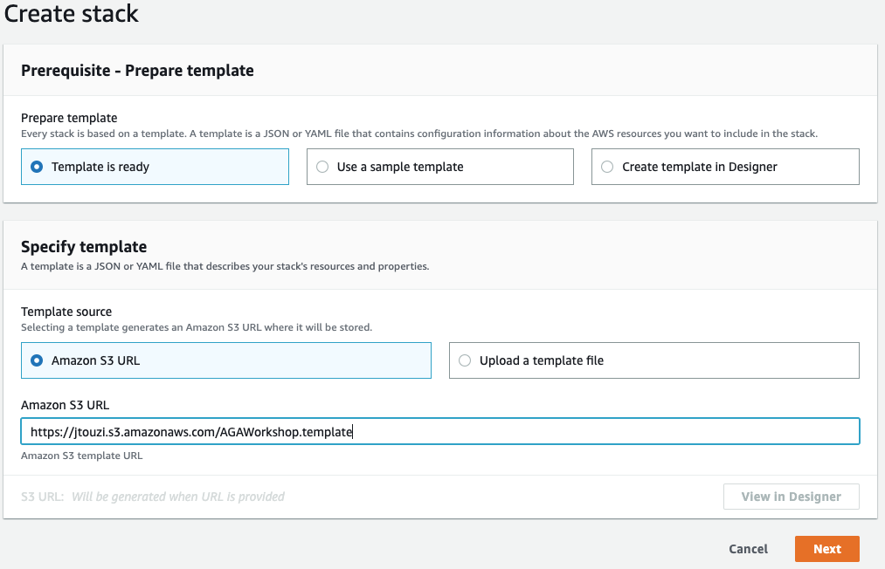
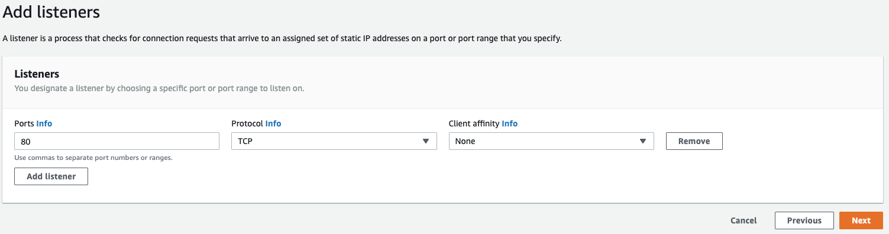
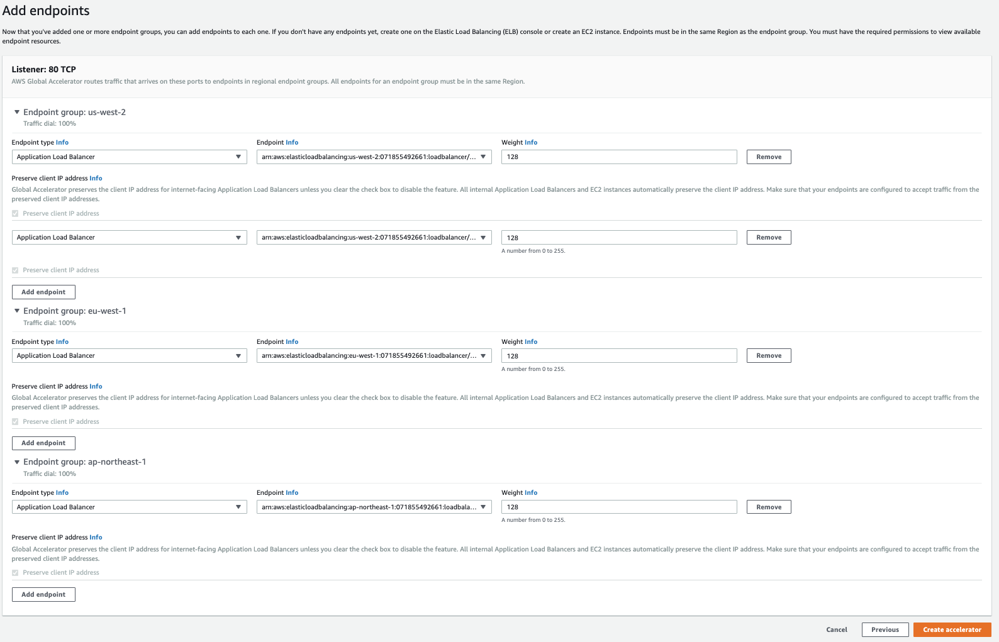

# Traffic management with AWS Global Accelerator
This repository contains instructions for getting started with AWS Global Accelerator.

In this workshop you will use the CloudFormtaion template to build a multiregion application, and then serve it with AWS Global Accelerator.

## What are we building

## Lab 0 - Launch the CloudFormation stack

The CloudFormation stack below will create:
- a VPC with an Internet Gateway and two private subnets
- a Lambda function
- an Application Load Balancer with the Lambda function as target
- an IAM role the Lambda service will assume
- a permission to the Application Load Balancer to invoke the Lambda function

After the workshop, simply delete the CloudFormation stack to delete all the above resources.

Launch the CloudFormation stack in two or more AWS Regions of your choice, note down the different regions you choose.

The link will load the CloudFormation Dashboard and start the stack creation process in the chosen region.

| Region | Launch Template |
|------- | -------- |
| Oregon (us-west-2) |  | 
| Dublin (eu-west-1) |  | 
| Tokyo (ap-northeast-1) |  | 
| Sydney (ap-southeast-2) |  | 
| Canada (ca-central-1) |  | 
| Mumbai (ap-south-1) |  | 

The template will automatically bring you to the CloudFormation Dashboard and start the stack creation process in the specified region. The default stack name "AGAWorkshop" (change it if you want to use a different name or if you want to deploy 2 endpoints in the same region), proceed through the wizard to launch the stack. Leave all options at their default values, but make sure to check the box to allow CloudFormation to create IAM roles on your behalf:

<kbd></kbd>

<kbd></kbd>

After you click on "Create stack", you will have the following window, it takes 3 to 4 minutes for the stack to be created.

<kbd></kbd>

<kbd></kbd>

For this workshop we will use Oregon, Dublin and Tokyo regions, I've created two endpoints in Oregon region.

## Lab 1 - Create an Accelerator

1. Open the Global Accelerator console at https://us-west-2.console.aws.amazon.com/ec2/v2/home?region=us-west-2#Global Accelerator:.
2. Choose Create accelerator.
3. Provide a name for your accelerator (AGAWorkshop), choose "Next"
<kbd></kbd>
4. Add the listeners (TCP port 80), choose "Next"
<kbd></kbd>
5. Add endpoint group (one per region in which you deployed the CloudFormation template), choose "Next"
<kbd></kbd>
6. Add endpoints to the endpoint groups (choose in the drop down the Application Load Balancers the template created), then choose "Create accelerator"
<kbd></kbd>
7. The Accelerator will be "In progress" status, it takes about 5 minutes to move to "Deployed" status, you should be able to see the two static anycast IP addresses and the DNS assigned to the Accelerator:
<kbd></kbd>

## Lab 2 - Intelligent traffic distribution
