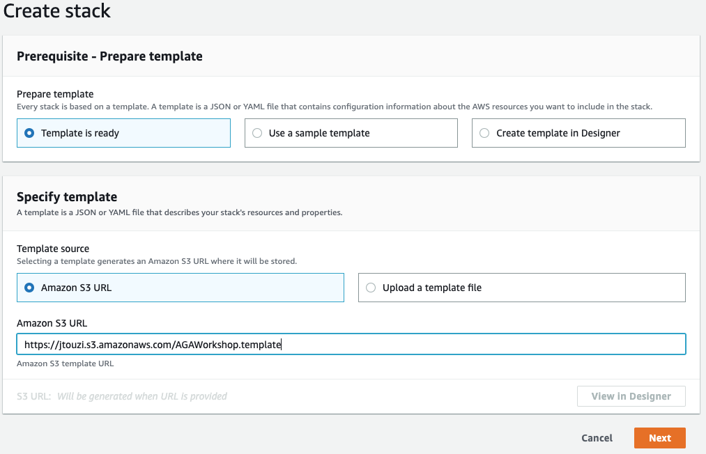
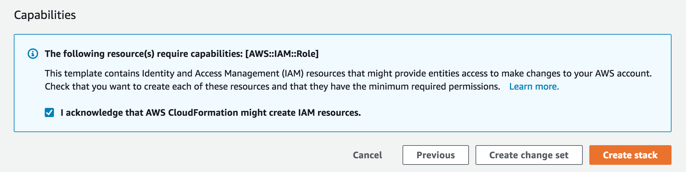
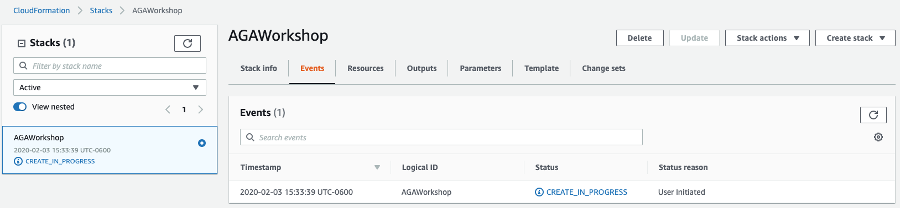
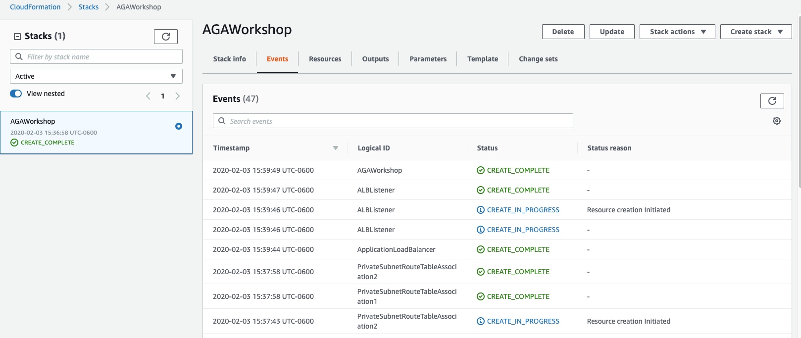
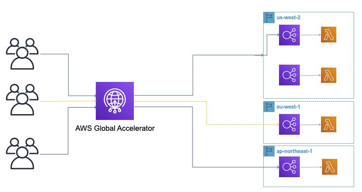

# Mythical Mysfits: Multi-Region Control with AWS Global Accelerator

## Workshop Progress
**[Lab 0: Workshop Initialization](../lab-0-init)**
- [Workshop Initialization](#1)
- [Familiarize Yourself with the Workshop Environment](#2)
- [Workshop Tips](#3)
[Lab 1: Create your first AWS Global Accelerator](../lab-1-create-aws-global-accelerator)

[Lab 2: Implement Intelligent Traffic Distribution](../lab-2-traffic-distribution)

[Lab 3: Implement Fine-grained traffic control](../lab-3-fine-grained-control)

[Lab 4: Implement Client Affinity](../lab-4-client-affinity)

[Lab 5: Implement Observability](../lab-5-observability)

[Bonus Lab: CloudWatch metrics and enabling flow logs](../lab-bonus)

[Workshop Cleanup - TBD](tbd-cleanup)

## Lab 0 - Workshop Initialization

In this lab, you'll launch the core infrastructure for the workshop via AWS CloudFormation. We'll have a section to explain what you're launching here, so don't worry. After the workshop, simply delete the CloudFormation stack to delete all the above resources. We have a cleanup section at the end as well to remind you.

Click here if you want a sneak peek of what you'll be launching

The CloudFormation stack below will create:
- a VPC with an Internet Gateway and two private subnets
- a Lambda function
- an Application Load Balancer with the Lambda function as target
- an IAM role the Lambda service will assume
- a permission to the Application Load Balancer to invoke the Lambda function

NOTE: In this workshop, we will NOT test AWS Global Accelerator performance, we will use four clients in different regions to show how AWS Global Accelerator routes requests based on users locations and the Accelerator settings (traffic dials, endpoint weights, failover, etc.). To test performance use real clients, or the Speed Comparison Tool - https://speedtest.globalaccelerator.aws/#/.

<a name="1"/>

### 1. Deploy Mythical CloudFormation Stack

Launch the CloudFormation stack in two or more AWS Regions of your choice, note down the different regions you choose.

The link will load the CloudFormation Dashboard and start the stack creation process in the chosen region.

| Region | Launch Template |
|------- | -------- |
| Oregon (us-west-2) |  |
| Dublin (eu-west-1) |  |
| Tokyo (ap-northeast-1) |  |
| Sydney (ap-southeast-2) |  |
| Canada (ca-central-1) |  |
| Mumbai (ap-south-1) |  |

The template will automatically bring you to the CloudFormation Dashboard and start the stack creation process in the specified region. The default stack name "aws-aga-workshop" (change it if you want to use a different name or if you want to deploy 2 endpoints in the same region), proceed through the wizard to launch the stack. Leave all options at their default values, but make sure to check the box to allow CloudFormation to create IAM roles on your behalf:

<kbd></kbd>

<kbd></kbd>

After you click on "Create stack", you will have the following window, it takes 3 to 4 minutes for the stack to be created.

<kbd></kbd>

<kbd></kbd>

For this workshop we will use Oregon, Dublin and Tokyo regions, I've created two endpoints in Oregon region.

<a name="2"/>

### 2. Familiarize yourself with the workshop environment

<kbd></kbd>

The CloudFormation template will launch the following resources:
- a VPC with an Internet Gateway and two private subnets
- a Lambda function
- an Application Load Balancer with the Lambda function as target
- an IAM role the Lambda service will assume
- a permission to the Application Load Balancer to invoke the Lambda function

<a name="3"/>

### 3. Workshop tips

These tips will help you be more efficient and save time.

* If you have a tablet with you, use that for the workshop instructions while you work on your laptop.
* "Right-click, Open Link in New Tab" is your friend - throughout the workshop you'll be navigating to various service dashboards in the AWS management console and referring back to lab instructions. Using multiple browser tabs will save you time.
* Open a text editor to copy/paste resource names or keep a tab open with the CloudFormation outputs. For example, to load the Mythical Mysfits application, you'll browse to the load balancer DNS name. This value is good to have easily accessible to save you time since you'll be loading the app throughout the workshop.

# Checkpoint

You now have an operational workshop environment to work with. [Proceed to Lab 1](../lab-1-create-aws-global-accelerator)

## Participation

We encourage participation; if you find anything, please submit an [issue](https://github.com/aws-samples/aws-global-accelerator-workshop/issues). However, if you want to help raise the bar, submit a [PR](https://github.com/aws-samples/aws-global-accelerator-workshop/pulls)!
