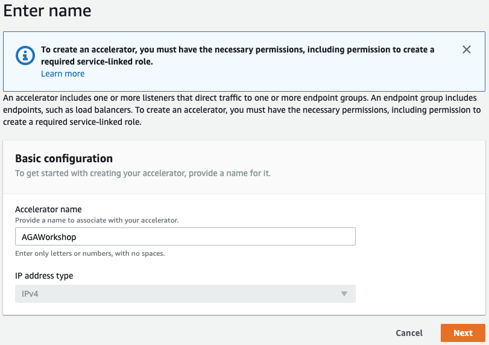
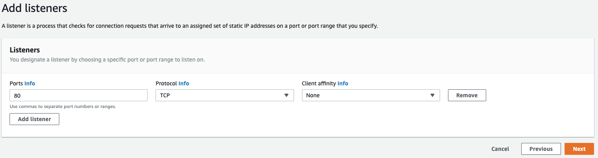
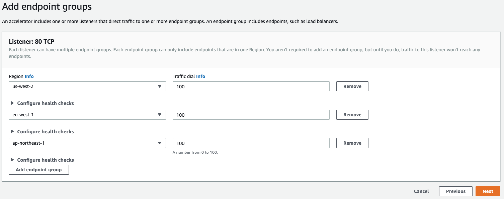
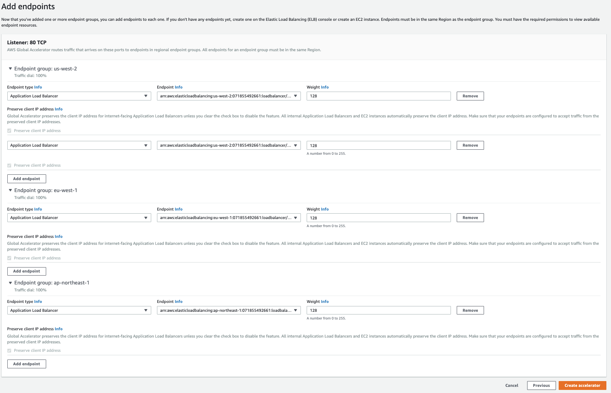
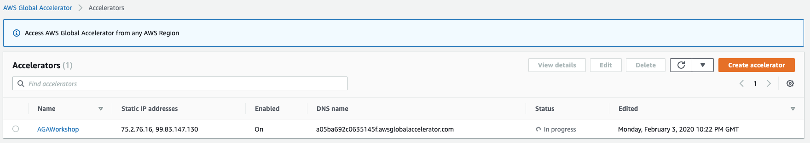
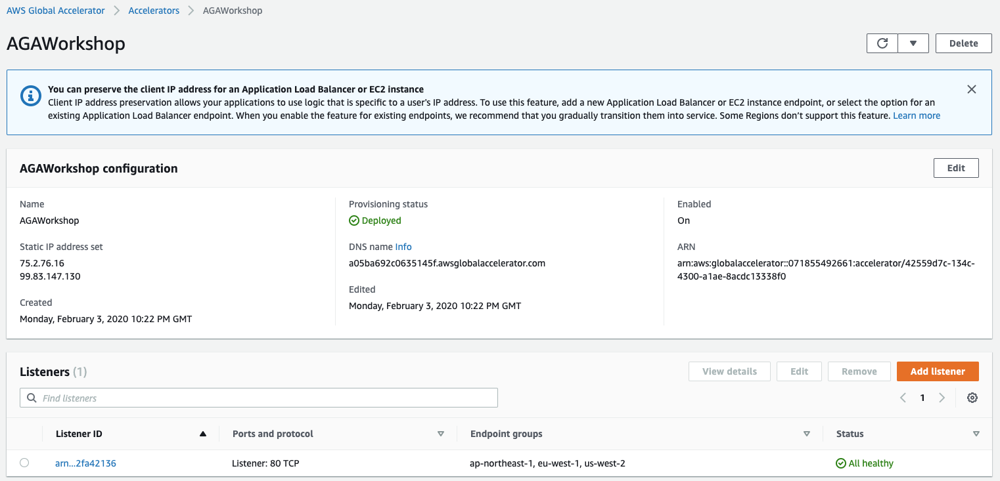
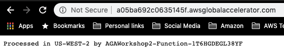

# Multi-Region traffic management with AWS Global Accelerator - Create an Accelerator

## Workshop Progress
✅ [Lab 0: Workshop Initialization](../lab-0-init)

**[Lab 1: Create your first Accelerator](../lab-1-create-aws-global-accelerator)**

[Lab 2: Implement Intelligent Traffic Distribution](../lab-2-traffic-distribution)

[Lab 3: Implement Fine-grained traffic control](../lab-3-fine-grained-control)

[Lab 4: Implement Client Affinity](../lab-4-client-affinity)

[Lab 5: Continuous availability monitoring and Failover](../lab-5-observability)

[Lab 6: Origin Cloaking](../lab-6-origin-cloaking)

[Bonus Lab: CloudWatch metrics and enabling flow logs](../bonus-lab)

[Clean up](../clean-up)

## Lab 1 - Create your first Accelerator

Traffic management is one of the largest pieces of the puzzle when it comes to multi-region architectures. The one that we will focus on today is AWS Global Accelerator. AWS Global Accelerator is a network layer service that directs traffic to optimal regional endpoints based on health, client location, and policies that you configure. It provides you with static IP addresses that you associate with your accelerator which will act as a fixed entry point to your application endpoints in one or more AWS Regions.

Global Accelerator uses the AWS global network to optimize the network path from your users to your applications, improving performance. It also monitors the health of your application endpoints and reacts instantly to changes in health or configuration. It will redirect user traffic to healthy endpoints that deliver the best performance and availability to your users.

In this lab, you will build upon the infrastructure you created in previous labs and use AWS Global Accelerator to route traffic between the Application Load Balancers in your primary and secondary regions.

Here's what you'll be doing:
- Create an Accelerator
- Add Listeners
- Add Endpoint Groups
- Add Endpoints
- Verify Endpoint Health
- Access Your Application

<a name="1"/>

### 1. Create and Name your Accelerator

The first step of this lab is to create and name an AWS Global Accelerator. The AWS Global Accelerator will serve as the entry point into your application. In the screenshots, we're using US-West-2 (Oregon), but you should be using the region that you launched your CloudFormation stack in.

1. Log into the AWS Management Console
2. Open the [Amazon Global Accelerator console](https://us-west-2.console.aws.amazon.com/ec2/v2/home?region=us-west-2#GlobalAcceleratorHome)
3. Choose **Create accelerator** and provide a name for your accelerator. In our workshop, we've named it AGAWorkshop
4. Choose **Next**

<kbd></kbd>

### 2. Configure the Accelerator listeners

Add the listeners (TCP port 80), choose "Next"

In order for your AWS Global Accelerator to know where to listen for traffic, we will need to add in a listener for TCP port 80.

1. Enter the following information:
  * Ports: **80**
  * Protocol: **TCP**
  * Client affinity: **None**
2. Click **Next**

Learn more: AWS Global Accelerator listeners

With AWS Global Accelerator, you add listeners that process inbound connections from clients based on the ports and protocols that you specify. Global Accelerator supports both TCP and UDP protocols.

You define a listener when you create your accelerator, and you can add more listeners at any time. You associate each listener with one or more endpoint groups, and you associate each endpoint group with one AWS Region.

See more information in the [Listeners in AWS Global Accelerator](https://docs.aws.amazon.com/global-accelerator/latest/dg/about-listeners.html) documentation.

<kbd></kbd>

### 3. Configure the AWS Global Accelerator endpoint groups

In the previous step, we created a listener, which tells AWS Global Accelerator where it should be listening for traffic. Now we need to tell it where to send the traffic. This is through **Endpoint Groups**. Endpoint Groups contain one or more registered endpoints to send traffic to and is effectively a container construct for the endpoints. Now let's add some endpoint groups. The number of groups will depend on the number of regions you're deployed in. We will also be configuring health checks in this step.

1. Enter the following information:
* Region: **[CHOOSE YOUR OWN REGION] - in our case, us-west-2**
  * Traffic Dial: **100** - We will get into traffic dials later
* Configure health checks: **eu-west-1**
  * Traffic dial: **100**
* Configure health checks: **ap-northeast-1**
  * Traffic dial: **100**

Learn more: AWS Global Accelerator endpoint groups and health checks

See more information in the [Endpoint Groups in AWS Global Accelerator](https://docs.aws.amazon.com/global-accelerator/latest/dg/about-endpoint-groups.html) and [Health Checks for AWS Global Accelerator](https://docs.aws.amazon.com/global-accelerator/latest/dg/introduction-how-it-works.html#about-endpoint-groups-automatic-health-checks) documentation.

<kbd></kbd>

### 4. Configure endpoint groups and add endpoints

We created the endpoint groups previously and now need to configure the actual endpoints. This is the end location where AWS Global Accelerator is going to send traffic. Endpoints in AWS Global Accelerator can be Network Load Balancers, Application Load Balancers, EC2 instances, or Elastic IP addresses.

As part of the CloudFormation setup in Lab 0, we created an Application Load Balancer (ALB) to route traffic to. In this step, you will be configuring the endpoint group to point at the ALBs created by CloudFormation.

1. For each region in the endpoint group, choose:
* Endpoint Type: **Application Load Balancer**
* Endpoint: **[CHOOSE THE ENDPOINT THAT WAS CREATED FOR YOU VIA CLOUDFORMATION]** - The list will auto-populate for you
* Weight: **128**
2. Click **Create accelerator**

Learn more: AWS Global Accelerator endpoints

A static IP address serves as a single point of contact for clients, and Global Accelerator then distributes incoming traffic across healthy endpoints. Global Accelerator directs traffic to endpoints by using the port (or port range) that you specify for the listener that the endpoint group for the endpoint belongs to.

Each endpoint group can have multiple endpoints. You can add each endpoint to multiple endpoint groups, but the endpoint groups must be associated with different listeners.

See documentation for [Endpoints in AWS Global Accelerator](https://docs.aws.amazon.com/global-accelerator/latest/dg/about-endpoints.html)

<kbd></kbd>

### 5. Patiently wait for deployment

Great job! The AWS Global Accelerator service is now creating an AWS Global Accelerator for you. This typically takes about 5 minutes to move from the **In Progress** status to the **Deployed** status. Once it's deployed, you should be able to see the two static anycast IP addresses and the assigned DNS name for the accelerator. You will need these things later.

Learn more: AWS Global Accelerator BYOIP

AWS Global Accelerator uses static IP addresses as entry points for your accelerators. These IP addresses are anycast from AWS edge locations. By default, Global Accelerator provides static IP addresses from the Amazon IP address pool. Instead of using the IP addresses that Global Accelerator provides, you can configure these entry points to be IPv4 addresses from your own address ranges.

See documentation for [AWS Global Accelerator Bring Your Own IP](https://docs.aws.amazon.com/global-accelerator/latest/dg/using-byoip.html).

<kbd></kbd>

### 6. Verify endpoint health

Once the accelerator is in a **Deployed** state, we should double check that the back end endpoints are healthy. There is a really easy way to do this and that's just to look at the accelerator itself.

1. Click on the accelerator link
2. Take a look at the bottom window pane at **Listeners**. You should see **All healthy** on the right. If not, you may have configured the listeners incorrectly. Go back up a few steps.

Important note: AWS Global Accelerator Health Checks

Global Accelerator requires your router and firewall rules to allow inbound traffic from the IP addresses associated with Route 53 health checkers to complete health checks for Application Load Balancer, EC2 instance, or Elastic IP address endpoints. You can find information about the IP address ranges associated with Amazon Route 53 health checkers in [Health Checks for Your Target Groups](https://docs.aws.amazon.com/Route53/latest/DeveloperGuide/route-53-ip-addresses.html) in the Amazon Route 53 Developer Guide.

See documentation for [AWS Global Accelerator Health check options](https://docs.aws.amazon.com/global-accelerator/latest/dg/about-endpoint-groups-health-check-options.html).

<kbd></kbd>

### 7. Access your application
At this point, you have deployed an AWS Global Accelerator and should be able to access your back end application. Get the URL for your accelerator and put it into a browser window to see if everything works. If you get a valid response back, that's a good indicator that your application is up and serving traffic.

Navigate to the AWS Global Accelerator DNS entry given to you in the AWS Global Accelerator console

<kbd></kbd>

<a name="checkpoint"/>

# Checkpoint
You have now created an Accelerator with AWS Global Accelerator, with Application Load Balancers in different regions as endpoints.

Let's see how AWS Global Accelerator distributes traffic from different clients around the world! When you're ready, [proceed to Lab 2](../lab-2-traffic-distribution)!

## Participation

We encourage participation; if you find anything, please submit an [issue](https://github.com/aws-samples/aws-global-accelerator-workshop/issues). However, if you want to help raise the bar, submit a [PR](https://github.com/aws-samples/aws-global-accelerator-workshop/pulls)!
