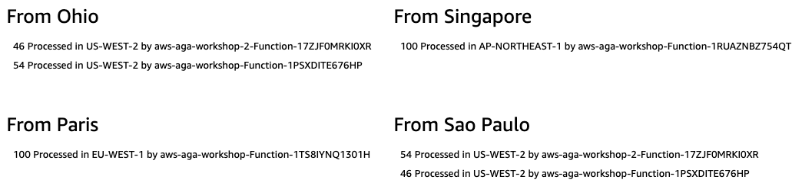

# Mythical Mysfits: Multi-Region Control with AWS Global Accelerator


## Workshop Progress
✅ [Lab 0: Workshop Initialization](../lab-0-init)

✅ [Lab 1: Create your first AWS Global Accelerator](../lab-1-create-aws-global-accelerator)

**[Lab 2: Implement Intelligent Traffic Distribution](../lab-2-traffic-distribution)**

[Lab 3: Implement Fine-grained traffic control](../lab-3-fine-grained-control)

[Lab 4: Implement Client Affinity](../lab-4-client-affinity)**

[Lab 5: Continuous availability monitoring and Failover](../lab-5-observability)

[Bonus Lab: CloudWatch metrics and enabling flow logs](../bonus-lab)

[Clean up](../clean-up)

## Lab 2 - Intelligent Traffic Distribution

In this lab we will help you understand how AWS Global Accelerator routes requests based on the origin of the requester. 

We kept the default traffic dials (100%)

<kbd></kbd>

Let's see how AWS Global Accelerator routes the requests based on the origin of the requester - we spinned up 4 clients in different regions (Ohio, Singapore, Paris and Sao Paulo). Again, we are not testing performance, just how AWS Global Accelerator routes requests based on user locations.

We use the following command to send 100 requests to the accelerator DNS per client:

```
$ for i in {1..100}; do curl http://123abc456def.awsglobalaccelerator.com/ --silent >> output.txt; done; cat output.txt | sort | uniq -c ; rm output.txt;
```

<kbd></kbd>

### Comments
1. Requests from Paris are processed in EU-WEST-1 (Dublin).
2. Requests from Ohio and Sao-Paolo are processed in US-WEST-2 (Oregon), we have two endpoints in Oregon region, AWS Global Accelerator sends 50% of traffic to each endpoint (Endpoint weights).
3. Requests from Singapore are processed in AP-NORTHEAST-1 (Tokyo).

<a name="lab3"/>

# Checkpoint

You now have an operational workshop environment to work with. [Proceed to Lab 3](../lab-3-fine-grained-control)

## Participation

We encourage participation; if you find anything, please submit an [issue](https://github.com/aws-samples/aws-global-accelerator-workshop/issues). However, if you want to help raise the bar, submit a [PR](https://github.com/aws-samples/aws-global-accelerator-workshop/pulls)!
