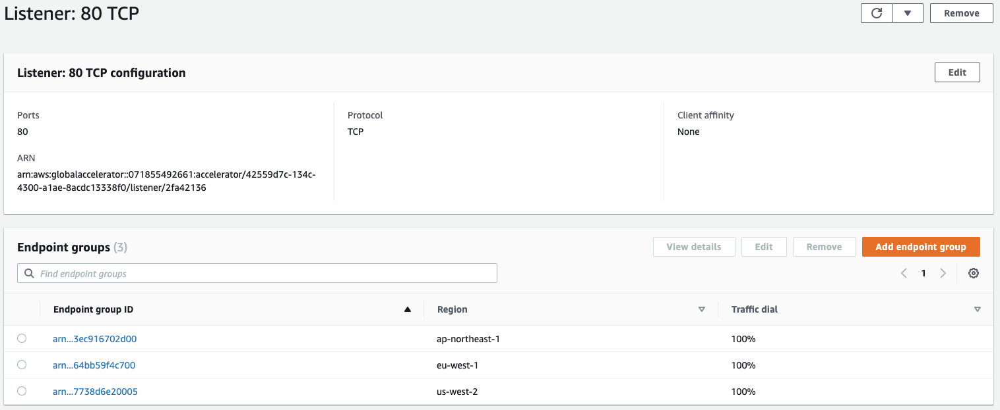
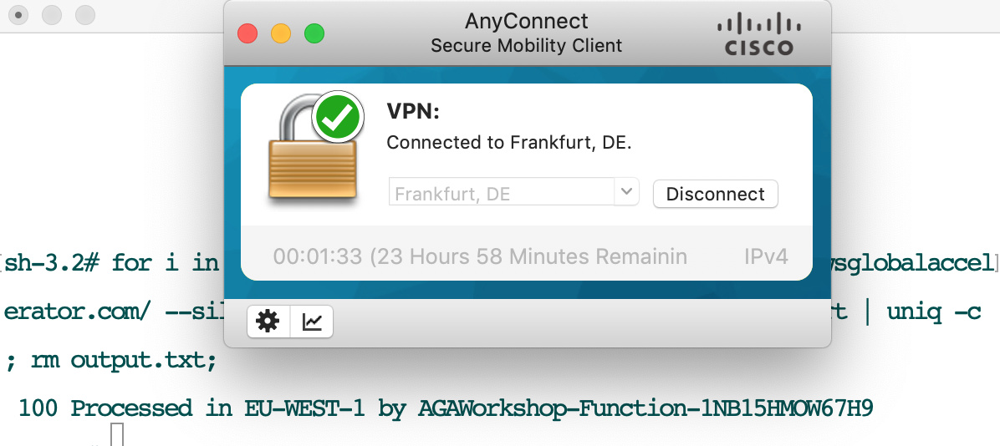
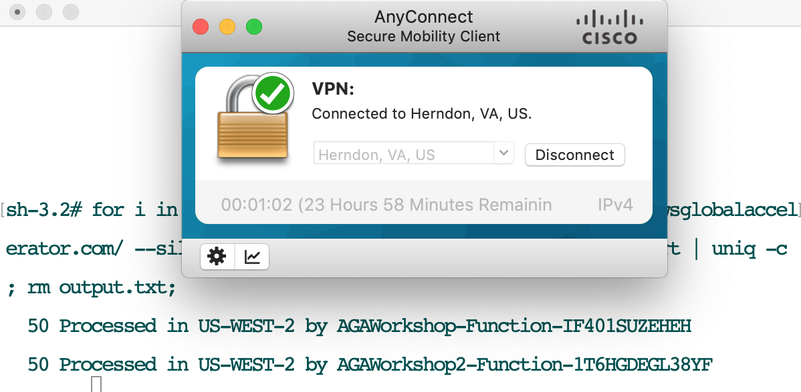
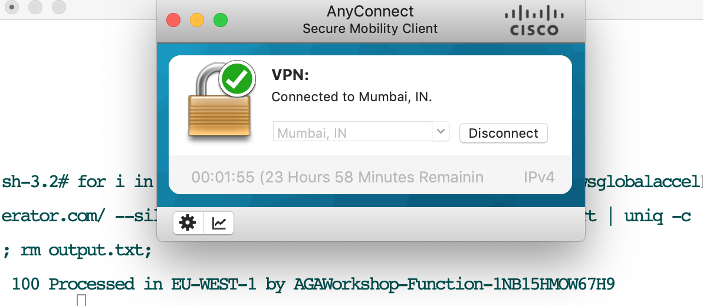
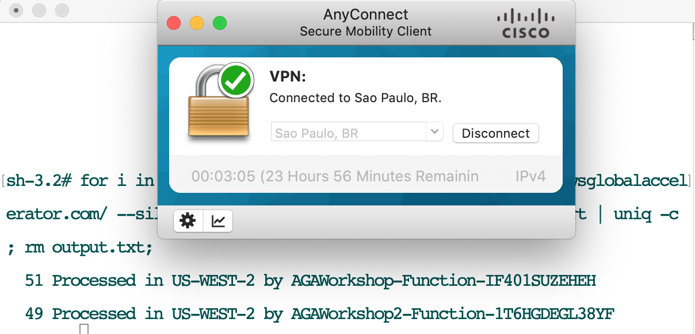
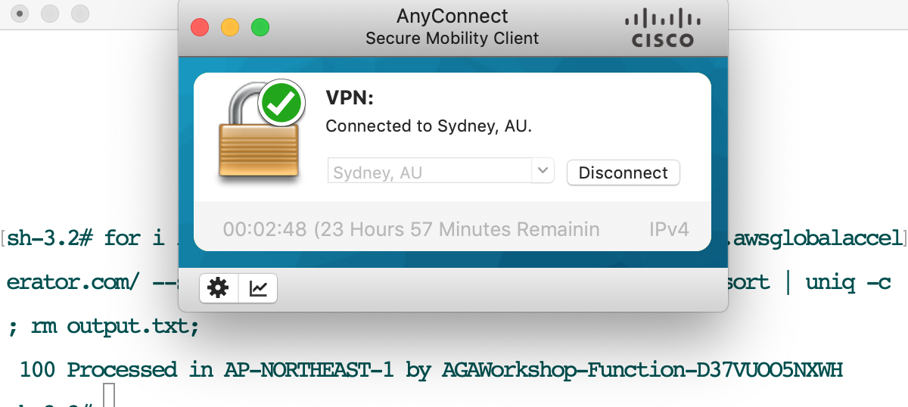

# Mythical Mysfits: Multi-Region Control with AWS Global Accelerator


## Workshop Progress
Placeholder

## Lab 2 - Intelligent Traffic Distribution

In this lab we will help you understand how AWS Global Accelerator routes requests based on the origin of the requester. 

We kept the default traffic dials (100%)

<kbd></kbd>

Let's see how AWS Global Accelerator routes the requests based on the origin of the requester - we use the VPN to similuate requests from four different locations (Frankfurt, Herndon, Mumbai, Sao Paolo and Sydney) by running the following Bash command (use your accelerator DNS):

```
$ for i in {1..100}; do curl http://a05ba692c0635145f.awsglobalaccelerator.com/ --silent >> output.txt; done; cat output.txt | sort | uniq -c ; rm output.txt;
```

<kbd></kbd>

<kbd></kbd>

<kbd></kbd>

<kbd></kbd>

<kbd></kbd>

### Comments
1. Requests from Frankfurt and Mumbai are processed in EU-WEST-1 (Dublin)
2. Requests from Herndon and Sao-Paolo are processed in US-WEST-2 (Oregon), we have two endpoints in Oregon region, AWS Global Accelerator sends 50% of traffic to each endpoint (Endpoint weights).
3. Requests from Sydney are processed in AP-NORTHEAST-1 (Tokyo)

<a name="lab3"/>

# Checkpoint

You now have an operational workshop environment to work with. [Proceed to Lab 3](../lab-3-fine-grained-control)

## Participation

We encourage participation; if you find anything, please submit an [issue](https://github.com/aws-samples/aws-global-accelerator-workshop/issues). However, if you want to help raise the bar, submit a [PR](https://github.com/aws-samples/aws-global-accelerator-workshop/pulls)!
