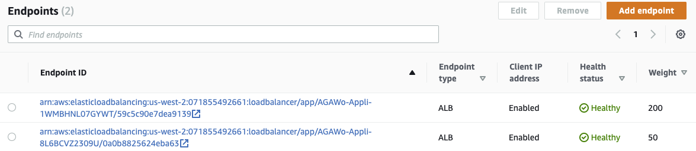

# Mythical Mysfits: Multi-Region Control with AWS Global Accelerator

## Workshop Progress
Placeholder

## Lab 3 - Fine-grained traffic control with traffic dials

In this lab, we will simulate a specific use case. For the purposes of this workshop, let's pretend that our application in EU-WEST-1 (Ireland) needs to undergo an upgrade or maintenance. This is a very common use case for our customers and we will walk through how easy it is to redirect traffic using traffic dials.

Here's what you'll be doing
-
-
-
-
-

### Route traffic away from EU-WEST-1 region

We want to upgrade our application in EU-WEST-1, which means that we have to stop production traffic from hitting it. Fortunately, since we're using AWS Global Accelerator, this is really easy using traffic dials. For each endpoint group, you can set a traffic dial to control the percentage of traffic that is directed to the group. The percentage is applied only to traffic that is already directed to the endpoint group, not to all listener traffic.

1. Navigate to your AWS Global Accelerator
2. Set traffic dial to 0

<kbd></kbd>
<kbd></kbd>

Let's see how AWS Global Accelerator handles traffic from Frankfurt and Mumbai, previously processed in EU-WEST-1 region.

<kbd></kbd>

<kbd></kbd>

### Comments
Requests from Frankfurt are now processed in in US-WEST-1 (Oregon) and requests from Mumbai processed in AP-NORTHEAST-1 (Tokyo).

Learn more: AWS Global Accelerator Traffic Dials

For more information, see the [Adjusting Traffic Flow with Traffic Dials](https://docs.aws.amazon.com/global-accelerator/latest/dg/about-endpoint-groups-traffic-dial.html) documentation.

<a name="lab32"/>

### The upgrade/maintenance is completed in EU-WEST-1. We want to test it by sending only 20% of the traffic it is supposed to handle.

<kbd></kbd>

Let see how AWS Global Accelerator handles traffic from Frankfurt and Mumbai, remember they were previously all processed in EU-WEST-1 (Dublin).

<kbd></kbd>

<kbd></kbd>

### Comments
AWS Global Accelerator sends 20% of the traffic in EU-WEST-1 and 80% in the next closest available region, US-WEST-1 (Oregon) for requests from Frankfurt and AP-NORTHEAST-1 (Tokyo) for those from Mumbai.

Before you continue with the workshop, change back the traffic dial for US-WEST-1 region to 100%.

<kbd></kbd>

### Resources

Adjusting Traffic Flow With Traffic Dials: https://docs.aws.amazon.com/global-accelerator/latest/dg/about-endpoint-groups-traffic-dial.html

<a name="lab4"/>

## Lab 4 - Fine-grained traffic control with Endpoint Weights
In US-WEST-2 (Oregon) region we have two endpoints, in Lab 3 the two endpoints processed the same amount of traffic, they have the default endpoint weight (128). Let's say the first endpoint has more capacipty than the second, and we want it to handle 80% of the traffic processed in the region, we can set endpoint weights to 200 and 50 respectively for the first and second endpoint. The first will handle 200 / (200 + 50) = 80%, the second 50 / (200 + 50) = 20%

<kbd></kbd>

Let's see how AWS Global Accelerator will handle requests from Herndon.

<kbd></kbd>

### Comments
The first endpoint in the endpoint group handles around 80% of the traffic. If you want Global Accelerator to stop sending traffic to an endpoint, you can change the weight for that resource to 0 as we did for traffic dials.

### Resources

Endpoint Weights: https://docs.aws.amazon.com/global-accelerator/latest/dg/about-endpoints-endpoint-weights.html

Change back the endpoint weights to the default (128).

<a name="lab5"/>

# Checkpoint

You now have an operational workshop environment to work with. [Proceed to Lab 4](../lab-4-client-affinity)

## Participation

We encourage participation; if you find anything, please submit an [issue](https://github.com/aws-samples/aws-global-accelerator-workshop/issues). However, if you want to help raise the bar, submit a [PR](https://github.com/aws-samples/aws-global-accelerator-workshop/pulls)!
