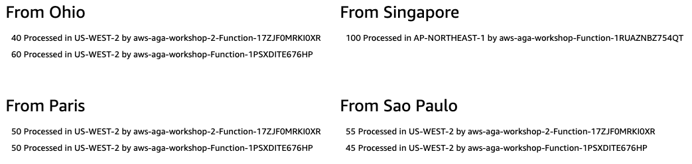
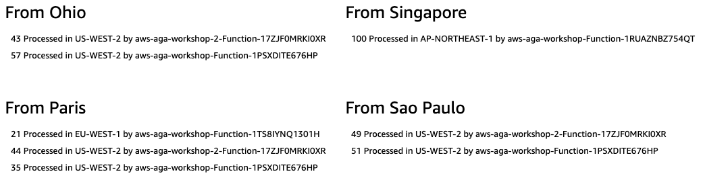
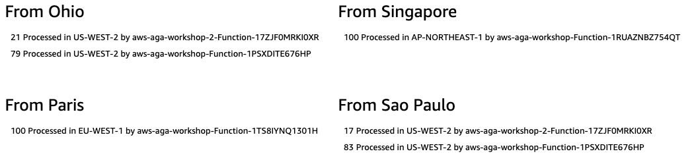

# Multi-Region traffic management with AWS Global Accelerator - Fine-grained traffic control

## Workshop Progress
✅ [Lab 0: Workshop Initialization](../lab-0-init)

✅ [Lab 1: Create your first AWS Global Accelerator](../lab-1-create-aws-global-accelerator)

✅ [Lab 2: Implement Intelligent Traffic Distribution](../lab-2-traffic-distribution)

**[Lab 3: Implement Fine-grained traffic control](../lab-3-fine-grained-control)**
- [Route traffic away from the eu-west-1 region](#1)
- [Slowly ramp traffic back to the maintenance site](#2)
- [Revert traffic levels back to 100%](#3)
- [Fine-grained traffic control with Endpoint Weights](#4)

[Lab 4: Implement Client Affinity](../lab-4-client-affinity)

[Lab 5: Continuous availability monitoring and Failover](../lab-5-observability)

[Lab 6: Origin Cloaking](../lab-6-origin-cloaking)

[Bonus Lab: CloudWatch metrics and enabling flow logs](../bonus-lab)

[Clean up](../clean-up)

## Lab 3 - Fine-grained traffic control with traffic dials and endpoint weights

AWS Global Accelerator relays on the **traffic dials** to control the percentage of traffic that is directed to an endpoint group, and on **endpoint weights** to determine the proportion of traffic that is directed to endpoints in an endpoint group. These are great options for ***A/B testing*** and ***blue/green deployments***, both for multi-region and single-region applications.

Learn more: Traffic dials vs endpoint weights. What's the difference?

Depending on what you want to do, you will want to use either traffic dials, endpoint weights, or both. With traffic dials, you can control all the traffic going to an entire endpoint group. This is a higher level control. With endpoint weights, we're now inside the endpoint group and controlling specific endpoints within the group, giving you more granular control over the traffic going to specific endpoints.

For more information, see our [documentation](https://docs.aws.amazon.com/global-accelerator/latest/dg/introduction-how-it-works.html#introduction-traffic-dials-weights)

In this lab, we will simulate a specific use case. For the purposes of this workshop, let's pretend that our application in EU-WEST-1 (Ireland) needs to undergo maintenance. This is a very common use case and we will walk through how easy it is to redirect traffic using traffic dials.

<a name="1"/>

### 1. Route traffic away from the EU-WEST-1 region

We want to upgrade our application in EU-WEST-1, which means that we have to stop production traffic from hitting it. Fortunately, since we're using AWS Global Accelerator, this is really easy using traffic dials. For each endpoint group, you can set a traffic dial to control the percentage of traffic that is directed to the group. The percentage is applied only to traffic that is already directed to the endpoint group, not to all listener traffic.

1. Navigate to the [AWS Global Accelerator Dashboard](https://console.aws.amazon.com/ec2/v2/home#GlobalAcceleratorDashboard) and choose your Accelerator
2. Choose the Listener you want to edit
3. Choose the Endpoint Group you want to edit
4. In the **Configuration** section, click **edit**
5. Set the **Traffic dial** to 0

<kbd></kbd>
<kbd></kbd>

Now that we've set the traffic dial, we should test. If all went well, no new connections should hit the EU-WEST-1 region, new connections from Paris should hit a different region.

<kbd></kbd>

Learn more: AWS Global Accelerator Traffic Dials

For more information, see the [Adjusting Traffic Flow with Traffic Dials](https://docs.aws.amazon.com/global-accelerator/latest/dg/about-endpoint-groups-traffic-dial.html) documentation.

<a name="2"/>

### 2. Slowly ramp traffic back to the maintenance site

Maintenance is done. Now it's time to start routing new connections back to the EU-WEST-1 region. What we'll do is send 20% of traffic to help us understand how the application is running. It's fairly common for customers to send some level of canary traffic in to a newly deployed application. It helps us minimize risk in case there was a deployment issue.

1. Follow the same steps as [before](#1) to set the traffic dial to **20%**

<kbd></kbd>

2. Once again, test the traffic. You should start seeing new connections back in the EU-WEST-1 region.

<kbd></kbd>

Learn more: How is traffic routed

AWS Global Accelerator sends 20% of new connections in EU-WEST-1 and 80% in the next closest available region, US-WEST-2 (Oregon) for requests from Paris.

<a name="3"/>

### 3. Revert traffic levels back to 100%

The last step of this lab is to change the trafic dial back to 100% for the EU-WEST-1 region. Follow steps in [Route traffic away from EU-WEST-1 region](#1) and set all values to 100%

<kbd></kbd>

<a name="4"/>

### 4. Fine-grained traffic control with Endpoint Weights

Now that our maintenance window is over and we've restored full levels of production traffic to all endpoint groups, we are now going to focus on individual endpoints within one region. In our scenario, inside US-WEST-2 (Oregon), we have two endpoints. Currently, they are serving equal amounts of traffic, but let's consider a use case where one endpoint has more capacity than the other and we want it to handle 80% of all traffic processed. To support this use case, we can set endpoint weights to 200 and 50. The first will handle 80% (200 / 200+50) and the second will handle 20% (50 / 200+50).

An Endpoint weight is a value that determines the proportion of traffic that Global Accelerator directs to an endpoint. Learn more...

A weight is a value that determines the proportion of traffic that Global Accelerator directs to an endpoint. Global Accelerator calculates the sum of the weights for the endpoints in an endpoint group, and then directs traffic to the endpoints based on the ratio of each endpoint's weight to the total.

Weighted routing lets you choose how much traffic is routed to a resource in an endpoint group. This can be useful in several ways, including load balancing and testing new versions of an application. See more details [here](https://docs.aws.amazon.com/global-accelerator/latest/dg/about-endpoints-endpoint-weights.html).

1. Navigate to the [AWS Global Accelerator Dashboard](https://console.aws.amazon.com/ec2/v2/home#GlobalAcceleratorDashboard) and choose your Accelerator
2. Choose the Listener you want to edit
3. Choose the Endpoint Group you want to edit
4. This time, select a specific endpoint and click **Edit**
5. Change the **Weight** to 200
6. Select the other endpoint and click **Edit**
7. Change the **Weight** to 50

<kbd></kbd>

8. Test how traffic is being handled

<kbd></kbd>

Learn more: Controlling traffic using Endpoint Weights

Note that the first endpoint in the endpoint group handles around 80% of the traffic. If you want Global Accelerator to stop sending new traffic to an endpoint, you can change the weight for that resource to 0 as we did for traffic dials.

9. Revert your endpoint weights back to 128 (Follow steps 4-7 but enter **128** in the **Weight** field)

<a name="checkpoint"/>

# Checkpoint

You have now implemented and tested fine grained traffic control with AWS Global Accelerator. You controlled traffic destined to an entire endpoint group using traffic dials as well as traffic destined to specific endpoints using endpoint weights.

Next on our global application to do list is to implement client affinity! When you're ready, [proceed to Lab 4](../lab-4-client-affinity)!

## Participation

We encourage participation; if you find anything, please submit an [issue](https://github.com/aws-samples/aws-global-accelerator-workshop/issues). However, if you want to help raise the bar, submit a [PR](https://github.com/aws-samples/aws-global-accelerator-workshop/pulls)!
