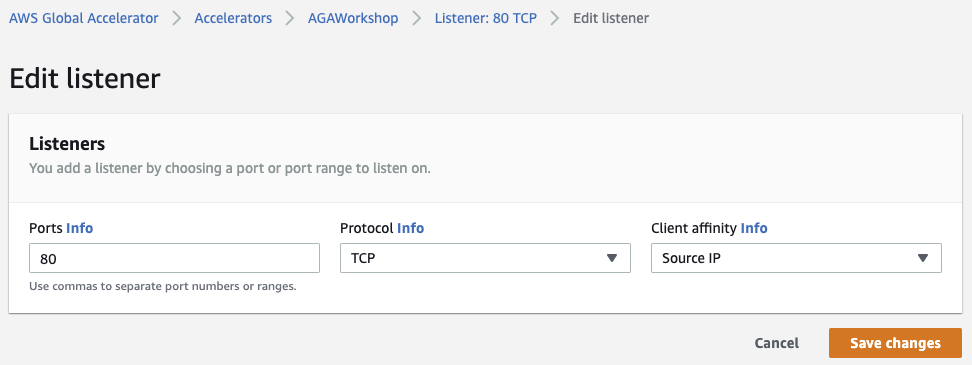
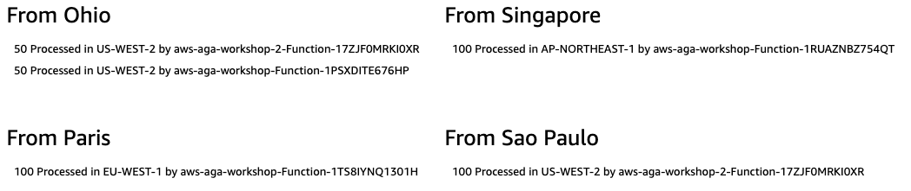

# Mythical Mysfits: Multi-Region traffic management with AWS Global Accelerator

## Workshop Progress
✅ [Lab 0: Workshop Initialization](../lab-0-init)

✅ [Lab 1: Create your first AWS Global Accelerator](../lab-1-create-aws-global-accelerator)

✅ [Lab 2: Implement Intelligent Traffic Distribution](../lab-2-traffic-distribution)

✅ [Lab 3: Implement Fine-grained traffic control](../lab-3-fine-grained-control)

**[Lab 4: Implement Client Affinity](../lab-4-client-affinity)**

[Lab 5: Continuous availability monitoring and Failover](../lab-5-observability)

[Bonus Lab: CloudWatch metrics and enabling flow logs](../bonus-lab)

[Clean up](../clean-up)

## Lab 4 - Client Affinity
If we want AWS Global Accelerator to direct all requests from a user at a specific source (client) IP address to the same endpoint resource (to maintain client affinity), we can change the "Client Affinity" from "None" (default) to "Source IP" for the listener.

<kbd></kbd>

Let's see how AWS Global Accelerator will handle requests from Herndon.

<kbd></kbd>

### Comments

US-WEST-2 has two endpoints, requests from Sao Paulo and Ohio have been processed by only 1 endpoint because of the client affinity.

### Resources
Client Affinity: https://docs.aws.amazon.com/global-accelerator/latest/dg/about-listeners.html#about-listeners-client-affinity

<a name="lab6"/>

# Checkpoint

You now have an operational workshop environment to work with. [Proceed to Lab 5](../lab-5-failover)

## Participation

We encourage participation; if you find anything, please submit an [issue](https://github.com/aws-samples/aws-global-accelerator-workshop/issues). However, if you want to help raise the bar, submit a [PR](https://github.com/aws-samples/aws-global-accelerator-workshop/pulls)!
