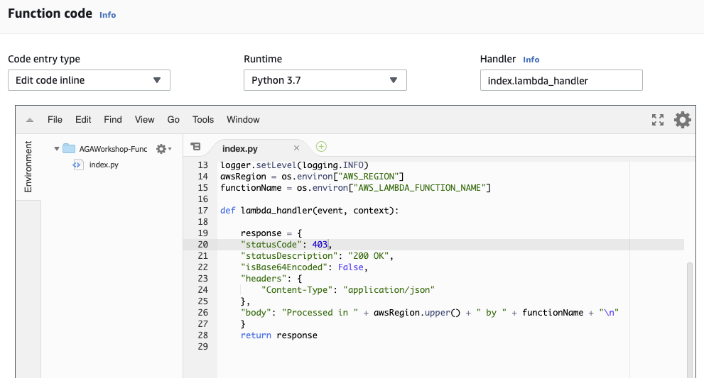
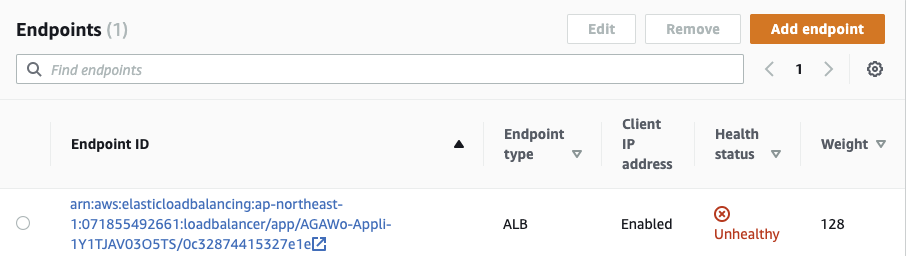
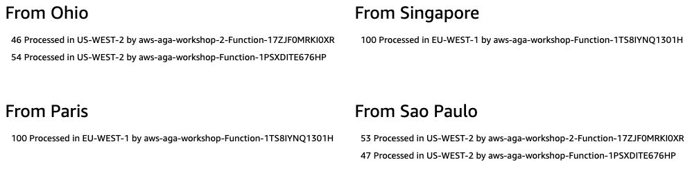

# Mythical Mysfits: Multi-Region Control with AWS Global Accelerator

## Workshop Progress
✅ [Lab 0: Workshop Initialization](../lab-0-init)

✅ [Lab 1: Create your first AWS Global Accelerator](../lab-1-create-aws-global-accelerator)

✅ [Lab 2: Implement Intelligent Traffic Distribution](../lab-2-traffic-distribution)

✅ [Lab 3: Implement Fine-grained traffic control](../lab-3-fine-grained-control)

✅ [Lab 4: Implement Client Affinity](../lab-4-client-affinity)

**[Lab 5: Continuous availability monitoring and Failover](../lab-5-observability)**

[Bonus Lab: CloudWatch metrics and enabling flow logs](../bonus-lab)

[Cleaning up](../clean-up)

## Lab 5 - Continuous availability monitoring and Failover

For some reason, our endpoint in AP-NORTHEAST-1 stops responding and the Application Load Balancer health check fails. AWS Global Accelerator will take up to 30 seconds (Health check interval) to notice the failure and to automatically redirect traffic to the next available region.

To simulate the failure, change the response status code returned by the [Lambda function](https://ap-northeast-1.console.aws.amazon.com/lambda/) from 200 to 403 for example and Save.

<kbd></kbd>

After a maximum of 60 seconds (30 seconds for the ALB and 30 seconds for the Global Accelerator health chekcs), the endpoint status will become "Unhealthy" and Global Accelerator will start sending traffic automatically to the next available endpoint.

<kbd></kbd>

Let's see how AWS Global Accelerator will handle requests from Singapore, normally processed by AP-NORTHEAST-1 (Tokyo) region.

<kbd></kbd>

### Comments
Requests from Singapore are now processed in EU-WEST-1 (Dublin) region. AWS Global Accelerator will continue to monitor the Tokyo endpoint, and will resume sending traffic to it once it becomes healthy.
