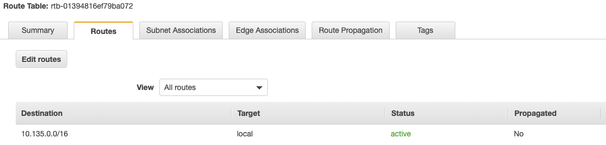

# Multi-Region traffic management with AWS Global Accelerator - Origin Cloaking

## Workshop Progress
✅ [Lab 0: Workshop Initialization](../lab-0-init)

✅ [Lab 1: Create your first AWS Global Accelerator](../lab-1-create-aws-global-accelerator)

✅ [Lab 2: Implement Intelligent Traffic Distribution](../lab-2-traffic-distribution)

✅ [Lab 3: Implement Fine-grained traffic control](../lab-3-fine-grained-control)

✅ [Lab 4: Implement Client Affinity](../lab-4-client-affinity)

✅ [Lab 5: Continuous availability monitoring and Failover](../lab-5-observability)

**[Lab 6: Origin Cloaking](../lab-6-origin-cloaking)**

[Bonus Lab: CloudWatch metrics and enabling flow logs](../bonus-lab)

[Cleaning up](../clean-up)

## Lab 6 - Origin Cloaking

The CloudFormation template we used in [Lab 0](../lab-0-init) created public subnets and internet facing Application Load Balancers, you can access these ALBs directly from any region using their DNS. For example let's try to access directly the Tokyo ALB from our four clients:

<kbd></kbd>

As you can see we can access the ALB directly from any client. Our application is currently exposed to 5 different access points (the 4 ALBs and the Global Accelerator endpoint), this exposes it to distributed denial of service (DDoS) attacks and does not allow you to have control over how your end users reach the application. AWS Global Accelerator offers a feature to obfuscate the source origin through functionality commonly referred to as **origin cloaking,** allowing private ALBs and private EC2 instances to be accessed through Global Accelerator in a secure and simplified manner.

Origin cloaking allows you to make Global Accelerator the single internet-facing access point for your applications running in a single or multiple AWS Regions. The applications are centrally protected from distributed denial of service (DDoS) attacks through AWS Shield. You can also have greater control over how your end users reach your applications.

Let's protect one of our ALBs from being accessed directly using it DNS, I choose the Tokyo ALB. For this we can make the Route table associated to the two Subnet the CloudFormation created private by removing the Route to the Internet Gateway:

- Open the [VPC Console](https://ap-northeast-1.console.aws.amazon.com/vpc/home?region=ap-northeast-1)
- Choose **Route Tables** on the left
- Select the Route table the CloudFormation created (by default *Public Route Table*)
- Select the **Routes** tab and then **Edit Routes**
- Delete the route to the Internet Gateway and click on **Save routes**.

The route table should look like the following:

<kbd></kbd>

Verify that the endpoint is no longer accessible directly:

<kbd></kbd>

Verify that the endpoint is accessible via AWS Global Accelerator:

<kbd></kbd>

You can repeat this for other route tables to protect your ALBs from being accessed directly using their DNS, Global Accelerator is the single entry point.

Since the next lab is about performance, let's revert the change we made to the route table (add a route to the Internet Gateway):

- Open the [VPC Console](https://ap-northeast-1.console.aws.amazon.com/vpc/home?region=ap-northeast-1)
- Choose **Route Tables** on the left
- Select the Route table the CloudFormation created (by default *Public Route Table*)
- Select the **Routes** tab and then **Edit Routes**
- Click on **Add route**
** Destination: 0.0.0.0/0
** Target: Select **Internet Gateway** in the dropdown menu, then the Internet Gateway ID the CloudFormation template created (by default *GlobalAcceleratorVPC Internet Gateway*)
- Click on **Save routes**

# Checkpoint

Now that we know how AWS Global Accelerator manages traffic, how we can increase or decrease the percentage of traffic sent to an endpoint group (using traffic dials) or a specific endpoint in an endpoint group (using endpoint weights), how we can send traffic from the same clients to the same endpoints (using Client Affinity) and how failover works, how we can protect our endpoints from DDoS attacks and from being accessed directly, let's work on AWS Global Accelerator performance. When you're ready proceed to [Lab 7](../lab-7-aga-performance).
